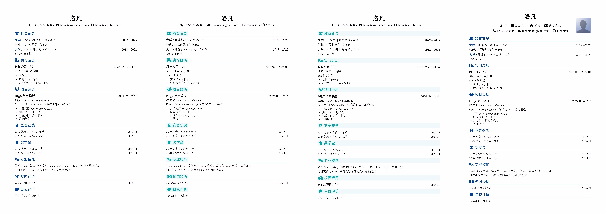

# 优雅的中文简历模板

一个基于LaTeX的优雅中文简历模板，支持多种样式和自定义选项。

## 效果图



## 特性

- 🎨 **多种标题样式**：支持默认、部分背景色、全背景色三种样式
- 📱 **响应式布局**：优化的页面边距和字体大小
- 🖼️ **头像支持**：可选的个人头像显示
- 🎯 **层次清晰**：section和subsection的清晰层次结构
- 🔧 **高度可定制**：易于修改颜色、字体、布局等
- 📄 **一页设计**：优化的空间利用，适合一页简历

## 快速开始

### 环境要求

- LaTeX发行版（推荐TeX Live 2023或更新版本）
- XeLaTeX编译器
- 中文字体支持

### 编译方法

```bash
# 使用makefile编译
make

# 或直接使用xelatex
xelatex resume-zh_CN.tex
```

### 文件结构

```
resume/
├── resume.cls                 # 主要的类文件
├── resume-zh_CN.tex          # 主文档
├── texs/
│   ├── header_with_photo.tex  # 带头像的头部
│   ├── header.tex            # 不带头像的头部
│   └── sections.tex          # 简历内容部分
├── stys/                     # 样式文件
│   ├── fontawesome6.sty      # FontAwesome图标
│   ├── zh_CN-Adobefonts_external.sty  # 中文字体支持
│   └── linespacing_fix.sty   # 行间距修复
├── fonts/                    # 字体文件
└── images/                   # 图片文件
```

## 使用方法

### 1. 基本信息设置

在 `texs/header_with_photo.tex` 中修改个人信息：

```latex
& 你的姓名 & \SetCell[r=3]{f} \includegraphics[width=0.7in]{images/your_photo} \\
& \boy\dotSep \calendar{出生日期} & \\
& \phone{手机号}\dotSep \email{邮箱} & \\
```

### 2. 内容编辑

在 `texs/sections.tex` 中编辑简历内容：

```latex
\sectionTitle{教育背景}{\faiconsixbf{graduation-cap}}
\datedsubsection{\texthl{学校名称} / \textit{专业} / \textit{学位}}{年份}
\normalline{研究方向或成绩}

\sectionTitle{项目经历}{\faiconsixbf{users}}
\datedsubsection{\textbf{项目名称}}{时间}
\subsectionTitleNoIcon{项目描述}
\projectdesc{项目描述内容}
\techstack{技术栈}
\subsectionTitleNoIcon{项目难点}
\begin{itemize}
  \item 技术要点1
  \item 技术要点2
\end{itemize}
```

### 3. 样式切换

在 `resume-zh_CN.tex` 中切换标题样式：

```latex
\settitlelinestyle{default}    % 默认样式
\settitlelinestyle{partialbg}  % 部分背景色
\settitlelinestyle{fullbg}     % 全背景色
```

## 自定义选项

### 颜色定制

在 `resume.cls` 中修改颜色定义：

```latex
\definecolor{cyanbg}{HTML}{f0fafa}
\definecolor{cyanfg}{HTML}{00a6a7}
\definecolor{nwpubluebg}{HTML}{01408f}
```

### 字体定制

修改字体设置：

```latex
\setmainfont[
  Path = fonts/Main/,
  Extension = .otf,
  UprightFont = *-regular,
  BoldFont = *-bold,
  ItalicFont = *-italic,
  BoldItalicFont = *-bolditalic,
  SmallCapsFont = Fontin-SmallCaps
]{texgyretermes}
```

### 页面边距

调整页面边距：

```latex
\RequirePackage[
  a4paper,
  left=0.75in,
  right=0.75in,
  top=0.5in,
  bottom=0.4in,
  nohead
]{geometry}
```

## 新增功能

### subsectionTitle命令

新增了 `\subsectionTitle` 和 `\subsectionTitleNoIcon` 命令，支持图标和不同样式：

```latex
\subsectionTitle{标题}{\faiconsixbf{icon}}
\subsectionTitleNoIcon{标题}
```

### 项目相关命令

新增了项目描述和技术栈的专用命令：

```latex
\projectdesc{项目描述内容}
\techstack{技术栈内容}
```

## 贡献

欢迎提交Issue和Pull Request来改进这个模板！

## 许可证

本项目基于MIT许可证开源。

## 致谢

- 基于 [liweitianux/resume](https://github.com/liweitianux/resume) 项目
- 使用FontAwesome图标
- 支持Adobe中文字体
